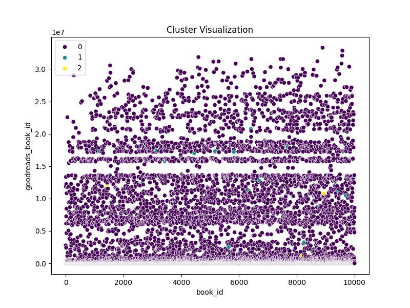
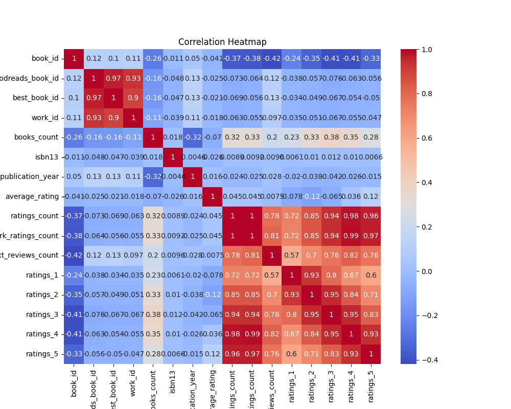

# Dataset Analysis

## Narrative Insights

# Business Report: Analysis of the Goodreads Dataset 

## Executive Summary

This report summarizes insights derived from the "Goodreads" dataset comprising 10,000 book records. It covers the summary statistics, missing values, correlation analysis, outlier detection, and clustering analysis, which together help to understand patterns related to book ratings, authors, and publication years. The findings can assist in enhancing product offerings, marketing strategies, and user engagement.

## Summary Statistics

- **Total Books**: 10,000
- **Average Rating**: 4.00 (on a scale of 1 to 5)
- **Mean Ratings Count**: Average number of ratings per book is approximately **54,001**.
- **Top Author**: Stephen King, with the highest frequency of books (60).

### Key Metrics
- **Best Book ID Average**: 5.47 million (high correlation with Goodreads Book ID: 0.97)
- **Original Publication Year Average**: 1982 (indicating a more established market)
  
### Missing Values
- Significant missing data includes `isbn` (700) and `ISBN13` (585), which may limit the ability to uniquely identify many books.
- **Action**: Efforts to standardize the ISBN fields and rectify missing values should be undertaken.

## Correlation Analysis

The correlation matrix indicates significant relationships:
- **Ratings Count & Average Rating**: Moderate negative correlation (-0.04), suggesting more ratings may lead to dilution of average ratings due to user variance in opinion.
- **Work Ratings Count**: High correlation (>0.99) with Ratings Count, indicating that more ratings typically come from popular works.

### Top Correlations
- **Work_text_reviews_count** and **ratings_count** show a negative correlation (-0.42): More text reviews correlate with reduced ratings, suggesting higher scrutiny by reviewers.
  
### Recommendations
1. **Targeted Marketing**: Focus promotional activities around high-rated, high-reviewed books to leverage user trust and engagement.
2. **User Engagement Initiatives**: Conduct user experience studies to understand the discrepancies in ratings and reviews.

## Outlier Detection

Outliers have been extensively identified across various fields, especially in:
- **Ratings Count**: Examples include extremely high frequency ratings for specific books, indicating potential for manipulation.
- **Authors and Publication Year**: Authors with significantly higher books may skew average ratings.

### Recommendations
1. **Content Verification**: Implement stronger content validity checks to minimize the impact of outliers on average ratings.
2. **Enhanced Review Systems**: Create thresholds for identifying and managing outlier ratings.

## Clustering Analysis

The clustering analysis identified three distinct groups (centroids):
1. **Group 1**: Dominates with average ratings and reviews — characterized by classic, highly-rated authors.
2. **Group 2**: Represents books with varied and generally lower ratings, indicating recent releases or lesser-known titles.
3. **Group 3**: Small niche group likely consisting of rare or specialized books.

### Action Items
1. **Diverse Offerings**: Tailor offerings to include both mainstream bestsellers and unique niche titles to attract diverse audiences.
2. **Promotional Campaigns**: Develop targeted campaigns for each group. For example, highlight popular titles with strong consumer engagement while promoting niche titles through specialized content.
  
## Conclusion

The analysis of the Goodreads dataset provides actionable insights into user preferences, rating behaviors, and potential areas for improvement in the overall user experience. By focusing on data integrity, leveraging high-quality content, and refining marketing strategies, Goodreads can enhance user satisfaction and loyalty. Continued monitoring of metrics such as average ratings and author engagement will be essential for future success. 

## Next Steps
- Initiate a project to standardize and fill in the missing data.
- Implement a system for flagging and reviewing potential outlier ratings.
- Design and roll out targeted marketing strategies based on identified clusters.
- Conduct user feedback sessions to continuously refine the platform’s offerings and experiences.

This comprehensive report should serve as a foundation for strategic decision-making moving forward, ensuring that Goodreads continues to thrive in the competitive market of book discovery and reader engagement.

## Key Visualizations

