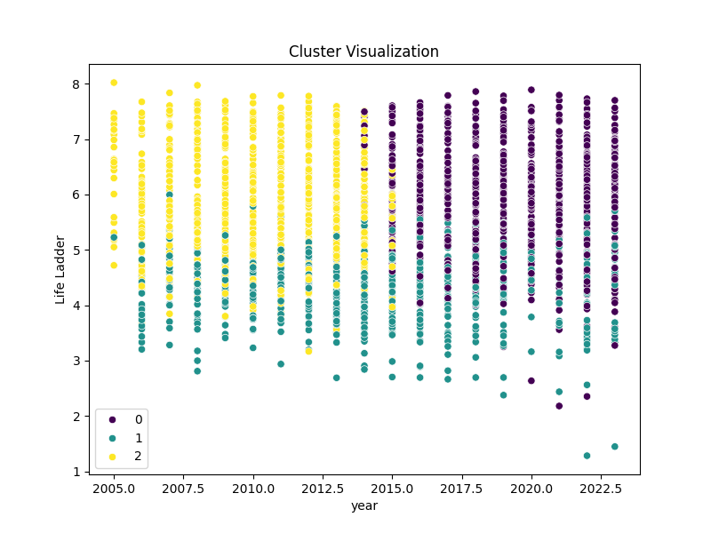
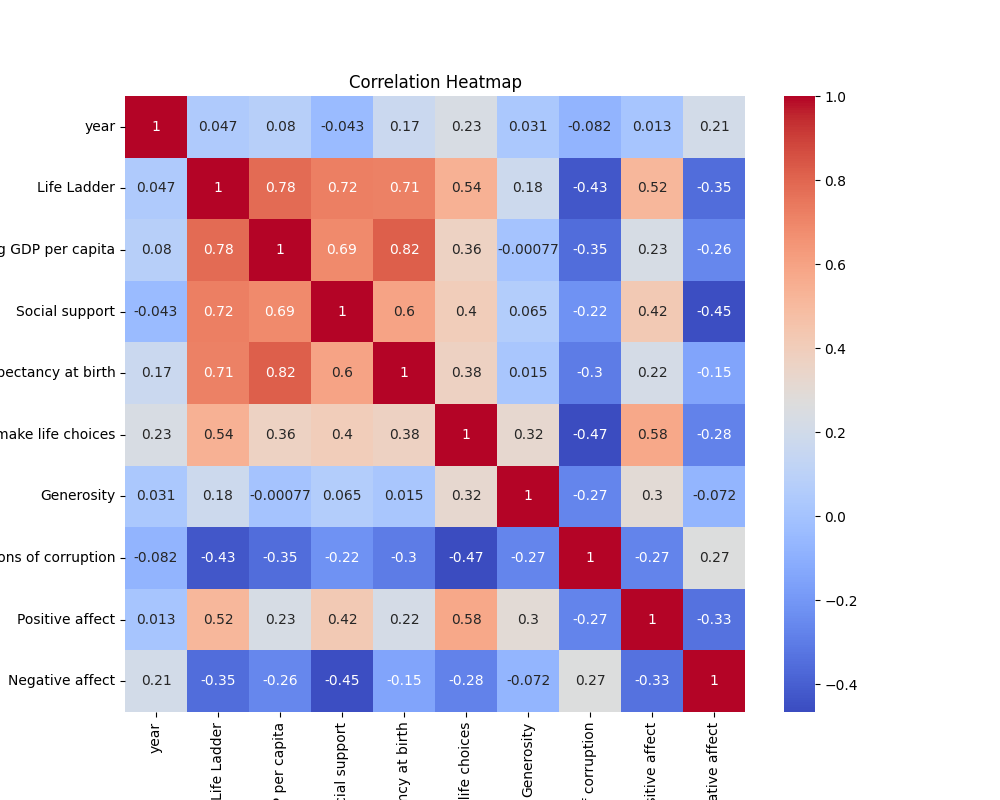

# Dataset Analysis

## Narrative Insights

# Business-Oriented Report on Happiness Dataset Findings

## Executive Summary
The "happiness" dataset provides valuable insights into factors impacting happiness across various countries from 2005 to 2023. It includes key metrics like GDP per capita, social support, healthy life expectancy, and perceptions of corruption. Our analysis indicates trends and patterns that inform potential business strategies and social initiatives.

## Key Findings

### 1. Summary Statistics
- **Country Representation**: The dataset contains data from 165 unique countries, with Argentina observed most frequently at 18 instances.
- **Year Range**: The average year of observation is around 2014, indicating a diverse timeframe for analysis.
- **Life Ladder**: The average happiness score (Life Ladder) is approximately 5.48, suggesting room for improvement in overall life satisfaction.
- **Key Metrics**:
  - Log GDP per capita: Average of 9.40 suggests a positive correlation with happiness.
  - Social support: Average score is approximately 0.81, reflecting the importance of community.
  - Healthy life expectancy averages 63.40 years, showing a direct correlation with overall well-being.

### 2. Missing Values
Several key metrics have missing values which can hamper analysis:
- Healthy life expectancy (63 missing entries) and Generosity (81 missing entries) are notable gaps.
- Plan to either impute missing values or focus on countries with complete data for more robust analysis.

### 3. Correlation Insights
- Strong positive correlations between:
  - Life Ladder and Log GDP per capita (0.78)
  - Life Ladder and Social Support (0.72)
  - Life Ladder and Healthy Life Expectancy (0.71)

- Notable negative correlation:
  - Life Ladder and Perceptions of Corruption (-0.43), indicating that perceived corruption negatively impacts happiness.

### 4. Outliers Detected
Outliers in various metrics (e.g., high positive affect and life ladder scores exceeding normal ranges) could skew results. This might suggest extreme cases of happiness or data entry errors that require further investigation.

### 5. Cluster Analysis
Three distinct clusters have been identified based on the characteristics of happiness-related data:
- **Cluster 0**: Generally lower in happiness measures and GDP per capita.
- **Cluster 1**: Moderate happiness but shows strong social support systems.
- **Cluster 2**: High in all metrics and reflects strong social structures supporting happiness.

## Recommendations

### 1. Focus on Economic and Social Development
- **GDP Growth Initiatives**: Invest in sectors that contribute to GDP growth as there is a strong correlation with happiness levels. 
- **Enhance Social Programs**: Foster social support networks, which are crucial for overall life satisfaction.

### 2. Transparency and Governance
- **Fight Corruption**: Engage in initiatives that promote transparency and lessen perceptions of corruption, as this has shown a significant negative impact on happiness. 

### 3. Address Health and Well-being
- **Improve Health Services**: Given the importance of healthy life expectancy, invest in healthcare initiatives that better the population’s health outcomes.

### 4. Invest in Data Integrity
- **Data Management Strategy**: Establish protocols to address missing data and verify the accuracy of recorded data. Consider periodic reviews to eliminate discrepancies in data entries.

### 5. Cross-Cultural Assessments
- **Tailored Strategies**: Design interventions that consider the cultural contexts of various countries, recognizing that happiness metrics and correlates can vary significantly between regions.

## Conclusion
The analysis of the happiness dataset reveals critical insights that businesses and policymakers can leverage to enhance societal well-being. By focusing on economic growth, social support, transparency, health, and data integrity, initiatives can be developed that align closely with improvements in happiness metrics across diverse populations. Implementing these recommendations may not only elevate individual happiness levels but can simultaneously drive business growth and social development.

## Key Visualizations

