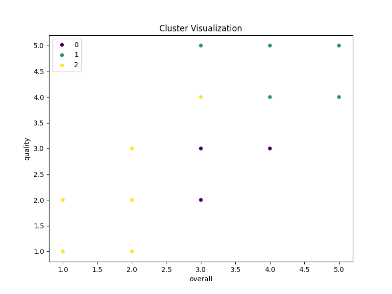
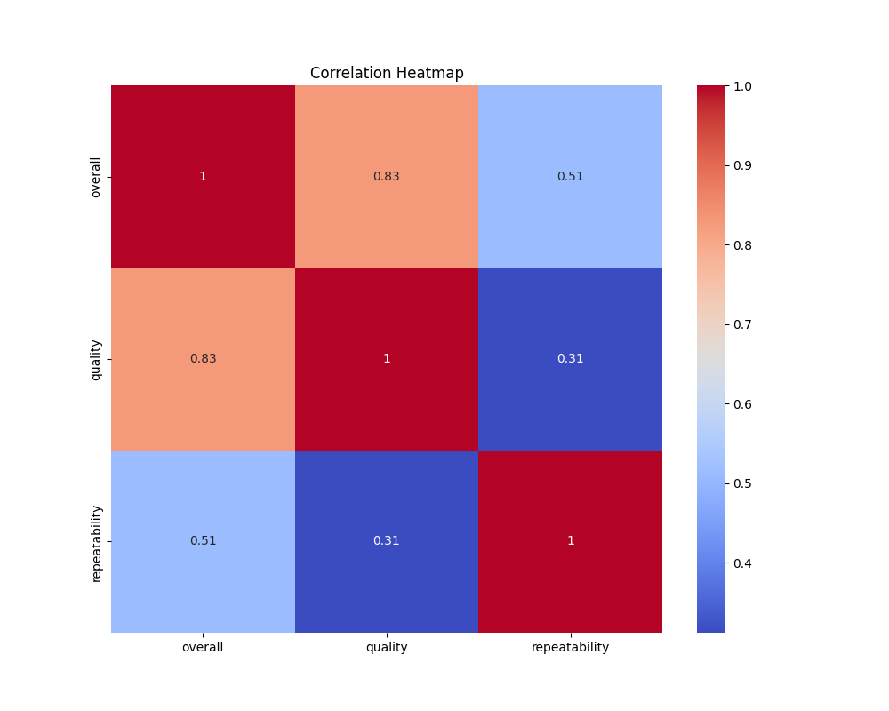

# Dataset Analysis

## Narrative Insights

## Business Report: Media Dataset Insights

### Executive Summary
This report presents a comprehensive analysis of the "media" dataset, which contains 2,652 records across various attributes related to media content such as film and language. The findings include summary statistics, missing values analysis, correlation metrics, identification of outliers, and insights from cluster analysis. Recommendations are provided at the end to enhance decision-making and improve content delivery.

### Summary Statistics
1. **Date**: A total of 2,553 entries, with 205 unique dates. The most frequent date is '21-May-06', occurring 8 times.
2. **Language**: The dataset includes 2652 entries with 11 unique languages, primarily English (1,306 occurrences).
3. **Type**: The majority of records (2,211) are categorized as movies, indicating a strong focus on this media type.
4. **Title**: A wide variety of titles (2,312 unique) is present, with "Kanda Naal Mudhal" being mentioned 9 times.
5. **By (Creator/Director/Actor)**: There are 2,390 entries related to creators, with 1,528 unique names. Kiefer Sutherland is the most frequent, noted 48 times.
6. **Overall Rating**: The average rating is approximately 3.05 (out of 5), with minimal variance (std dev: 0.76).
7. **Quality Rating**: The average quality rating is approximately 3.21 (std dev: 0.8), demonstrating relatively high ratings.
8. **Repeatability**: This aspect shows an average of 1.49, indicating that most content is generally viewed once or twice.

### Missing Values
- **Significant missing values** were identified in the "date" (99), and "by" (262) fields.
  
| Attribute      | Missing Values |
|----------------|-----------------|
| Date           | 99              |
| Language       | 0               |
| Type           | 0               |
| Title          | 0               |
| By             | 262             |
| Overall        | 0               |
| Quality        | 0               |
| Repeatability   | 0               |

### Correlation Analysis
The correlation matrix reveals strong relationships among ratings:
- Between overall and quality: **0.83** (high correlation),
- Overall and repeatability: **0.51** (moderate correlation),
- Quality and repeatability: **0.31** (low correlation).

### Outlier Detection
A number of outliers have been discovered in the overall ratings, notably at the low end (1-2) and high end (4-5 scales). It is crucial to analyze outliers to evaluate and improve the consistency and reception of content.

### Cluster Analysis
Cluster analysis identified three primary clusters based on ratings:
1. **Cluster 0**: Low overall and quality ratings.
2. **Cluster 1**: Medium ratings with moderate repeatability.
3. **Cluster 2**: High overall and quality ratings.

### Actionable Recommendations
1. **Fill Missing Values**: Investigate the source of missing dates and creator information to enhance the dataset’s integrity. Consider applying imputation strategies based on existing data trends.
   
2. **Focus on Movies**: Given the strong preference for movies, consider investing more heavily in the development, marketing, and acquisition of movie content, along with high-quality productions featuring popular creators or actors.
   
3. **Boost Quality**: As quality ratings are directly related to overall content experience, implement higher quality control standards for new releases.

4. **Address Outliers**: Conduct a deeper analysis of outlier instances to determine causes of extreme ratings. This could involve review processes or audience feedback mechanisms, facilitating improvements in future productions.

5. **Leverage Popular Languages**: Given the predominance of English content, consider increasing multimedia offerings in this language while also exploring opportunities in other popular languages to reach diverse audiences.

6. **Engage with Popular Creators**: Collaborate with frequently cited creators like Kiefer Sutherland to enhance content appeal and attract their fan base.

7. **Enhance Audience Engagement**: Utilize insights from repeatability data to create targeted engagement strategies for repeated viewings or recommendations, particularly for high-quality content.

### Conclusion
The "media" dataset analysis presents an opportunity for strategic growth by addressing missing data, emphasizing quality enhancements, and capitalizing on existing data trends. By implementing the recommendations, the organization can improve engagement, increase viewer satisfaction, and enhance its market position in the media landscape.

## Key Visualizations

