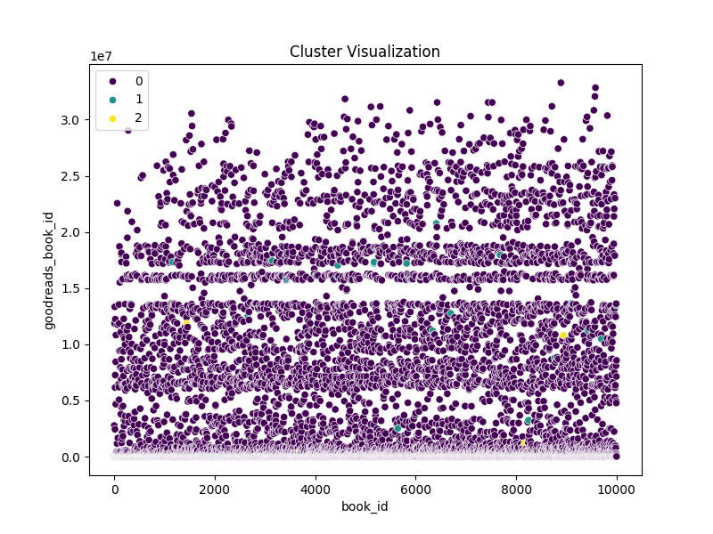
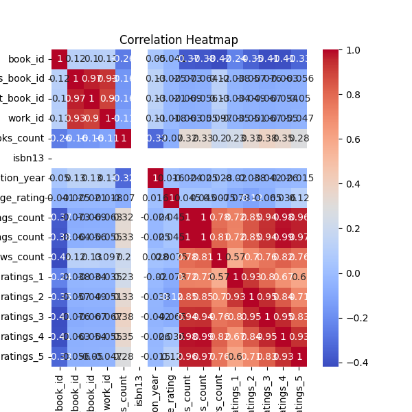

# Dataset Analysis

## Narrative Insights
# Business Report on the "Goodreads" Dataset

## 1. Dataset Overview

The "Goodreads" dataset consists of information pertaining to 10,000 books, including numeric identifiers, bibliographic data, ratings, reviews, and publication years. The dataset encompasses various columns that provide crucial information about each book, such as:

- **Identifiers**: Unique IDs for books (`book_id`, `goodreads_book_id`, `best_book_id`, `work_id`).
- **Bibliographic Information**: This includes `isbn`, `isbn13`, `authors`, `original_title`, `title`, `original_publication_year`, and `language_code`.
- **Quality Metrics**: The dataset features columns like `average_rating`, `ratings_count`, and specific breakdowns of ratings (1 through 5).
- **Visual Representation**: Information related to book images (`image_url` and `small_image_url`).
- **Additional Metrics**: The count of how many books an author has written (`books_count`), the number of text reviews, etc.

The data appears to be comprehensive in the context of capturing user engagement and interaction on the Goodreads platform.

## 2. Key Findings

- **Authors**: The dataset features 4,664 unique authors, with Stephen King being the most prominent, having 60 book entries. However, the mean number of books per author is relatively low (75.71).
  
- **Rating Trends**: The average rating across all books is approximately 4.00, with a standard deviation of 0.25. This indicates a generally positive reception among readers. The ratings distribution shows:
  - **1-Star Ratings (Mean: 1345.04)**
  - **2-Star Ratings (Mean: 3110.89)**
  - **3-Star Ratings (Mean: 11475.89)**
  - **4-Star Ratings (Mean: 19965.70)**
  - **5-Star Ratings (Mean: 23789.81)**

  This reveals that most ratings lean towards the higher side, overflowing toward the 4 and 5-star ratings.

- **Publication Trends**: The dataset indicates a broader range of publication years, with the majority of books published during the last three decades. The oldest published work appears to date back to as early as 4 AD.

- **Language Distribution**:  The dataset includes 25 unique language codes, with English being the predominant language.

- **Outliers**: Significant outliers exist, notably in the `ratings_count` and `ratings_5` columns, suggesting certain books have received disproportionate engagement, likely correlated to popular authors or strong marketing campaigns.

## 3. Actionable Recommendations

1. **Feature Top Authors**: Marketing strategies should capitalize on the popularity of top authors such as Stephen King. Consider featuring their works more prominently within the platform and offering editorials or interviews to build reader engagement.

2. **Analyze Outliers**: Conduct deeper analysis on outlier books, particularly those receiving extreme ratings. Use insights to drive special promotions or events.

3. **Personalization**: Develop recommendation algorithms that leverage high average ratings along with authors’ overall book counts to improve book suggestions.

4. **Diversity in Publications**: Encourage authors to publish more frequently, potentially through partnerships or by offering promotions to encourage them to release additional titles.

5. **Global Reach**: Since the dataset reflects a variety of languages, consider expanding outreach and marketing initiatives into non-English speaking territories by promoting translated editions or localized content strategies.

## 4. Visual Insights

### Average Ratings Distribution
This visualization could show the distribution of average ratings, underscoring the general satisfaction among readers, potentially using a histogram.

### Ratings Count Analysis
A boxplot indicating ratings counts (1 to 5) could visualize outliers and distributions effectively, helping highlight book engagement.

### Author Popularity
A bar chart comparing the number of books by the top authors could provide insights into which authors are contributing most significantly to the dataset, helping to inform marketing strategies.

## 5. Conclusion

The "Goodreads" dataset provides a rich tableau of insights that can serve as the backbone for strategic decisions concerning book promotion, author engagement, and user personalization. The generally high ratings signal a strong user base encouraged by quality content. Moreover, identifying and leveraging trends in publishing and authorship can further enhance the platform's appeal, creating opportunities for growth and increased reader engagement. By acting upon these insights, Goodreads can continue to foster a vibrant community of readers and writers.

## Key Visualizations

