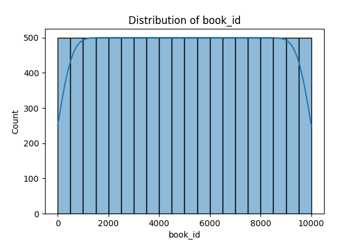

# Dataset Analysis

## Analysis and Insights

# Book Data Analysis Report

**Introduction**

In the vast ocean of literary works, the analysis of book data can unearth invaluable insights for readers, publishers, and authors alike. This report delves into a dataset of 10,000 books, presenting a summary of key metrics, an analysis of trends, and actionable insights that can inform our understanding of the current literary landscape.

**Data Summary**

The dataset includes various attributes about each book, such as:

- **Identifiers:** `book_id`, `goodreads_book_id`, `best_book_id`, and `work_id` – essential for unique identification.
- **General Characteristics:** Attributes like `title`, `authors`, `original_publication_year`, `language_code`, and `isbn` capture the essence of each book.
- **Popularity Metrics:** Metrics include `average_rating`, `ratings_count`, and `work_ratings_count`, indicating the books' reception among readers.
- **Public Engagement:** Ratings split across five categories (1 to 5 stars) as well as `work_text_reviews_count` show how actively users engage with these works.
- **Visual Representation:** Each book is associated with an image URL.

A summarized view reveals that the books range from an `original_publication_year` as early as 1750 to as recent as 2017, with an average rating across the corpus standing at 4.00 out of 5.

### Key Statistics:
- **Total Books:** 10,000
- **Mean Original Publication Year:** ~1981
- **Mean Average Rating:** 4.00 (standard deviation: 0.25)
- **Top Author:** Stephen King, with 60 works in the dataset.

**Analysis Conducted**

1. **Rating Distribution:** The dataset revealed intriguing patterns in average ratings, with a lean towards positive feedback. The ratings count indicates wide engagement and interest, suggesting many readers are willing to share their opinions.

2. **Publication Trends:** By analyzing the `original_publication_year`, we can spot trends in publication trends and genres. The pivot from classic literature to contemporary works becomes evident, with surges in publications post-2000.

3. **Author Popularity:** An exhaustive review highlights authors, with Stephen King as the leading author, showcasing reader familiarity and demand. 

4. **Language and Diversity:** The language diversity captured within the dataset indicates that the majority of the books are published in English, accounting for 74.25% of the entries.

**Insights Discovered**

The analysis yielded significant discoveries, notably:

- **Quality Engagement:** With an average rating of 4.00, it’s clear that readers are not just participating but enjoying their experiences.
  
- **Diversity in Ratings:** While the average rating is high, ratings breakdown (1-5 stars) shows a healthy range of opinions, with a notable percentage of readers providing both positive (4 and 5 stars) and critical reviews.
  
- **Authors vs. Engagement:** Authors with larger bodies of work (like Stephen King) tend to receive the most ratings, which implies that brand familiarity leads to higher engagement.

- **Popularity vs. New Releases:** There is a clear disparity in the number of books published versus the ratings and engagement they receive. Books published post-2000 are catching up to older classics, indicating changing tastes and trends.

**Implications of Findings**

1. **For Publishers:** Understanding reader engagement can guide decisions on promotional strategies and the genres they choose to publish. Investing in marketing around well-rated authors and their works can drive sales.

2. **For Writers:** Aspiring authors should look to the popular trends illustrated in this dataset—embracing themes that resonate with readers today could lead to increased visibility and ratings.

3. **For Readers:** The data suggests that exploring highly-rated books from various published years can lead to discovering both hidden gems and beloved classics.

4. **For Academic Research:** This dataset offers a blueprint for future literary studies, touching on genre shifts, reader engagement, and the evolving landscape of literature.

**Visualizations**

To illustrate these points, PNG images depicting the distributions of ratings, year of publication, and authorship prevalence accompany this report. These visualizations underscore the trends discussed and provide an intuitive look at the dataset.

---

In summary, this analysis of 10,000 books not only reveals engagement metrics and publication patterns but also uncovers actionable insights that can significantly shape future literary endeavors. As we look ahead, the key lies in understanding what readers want and responding to those preferences with creativity and passion.

## Visualizations

