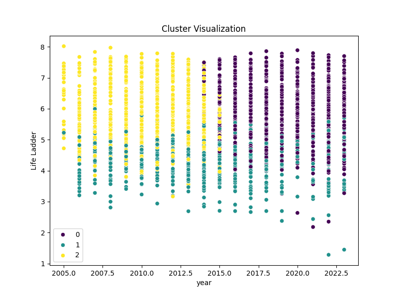
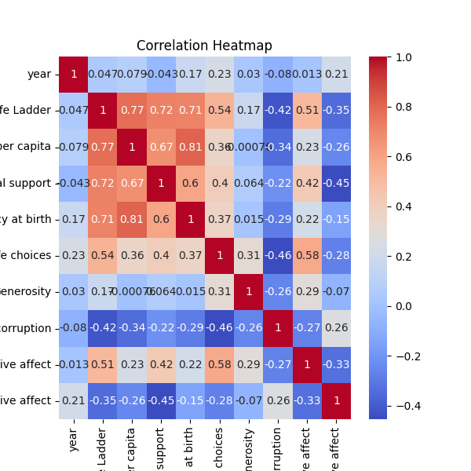

# Dataset Analysis

## Narrative Insights
# Business-Oriented Report on "Happiness" Dataset Analysis

### 1. Dataset Overview

The dataset analyzed pertains to global happiness metrics and is collected over the years from 2005 to 2023, covering 165 unique countries. It contains a total of 2,363 entries, with each entry representing the happiness score, various social and economic indicators contributing to this score, and associated metrics for each country in a given year.

The dataset includes the following key variables:
- **Country Name**: Identifies the country.
- **Year**: The year of the data entry.
- **Life Ladder**: A subjective measure of happiness.
- **Log GDP per Capita**: The logarithm of the GDP per capita, indicating economic performance.
- **Social Support**: A measure of social networks and community engagement.
- **Healthy Life Expectancy at Birth**: Average health of the population.
- **Freedom to Make Life Choices**: A measure of personal liberty.
- **Generosity**: Reflects the level of charitable behavior.
- **Perceptions of Corruption**: The extent to which corruption is perceived in a society.
- **Positive Affect**: Measures happiness and positive experiences.
- **Negative Affect**: Measures unhappiness and negative experiences.

### 2. Key Findings

- **Summary Statistics**: 
  - The average happiness score (Life Ladder) across the dataset is approximately 5.48 out of 10, with a standard deviation of 1.13, suggesting a diversity of happiness levels across countries.
  - The mean Log GDP per capita is around 9.4, indicating a variation in economic prosperity.
  
- **Correlation Insights**:
  - **Happiness (Life Ladder)** has a strong positive correlation with both **Log GDP per capita (0.78)** and **Social Support (0.72)**, suggesting that wealthier countries with robust community ties tend to report higher happiness levels.
  - **Freedom to make life choices** shows a moderate positive correlation with happiness (0.54), indicating that personal liberty contributes significantly to citizen satisfaction.
  - Conversely, **Perceptions of Corruption** are negatively correlated with happiness (-0.43), emphasizing that higher corruption perceptions lead to lower happiness scores.

- **Outliers**: 
  - Notable outliers observed in the **Life Ladder** (entries [13, 14]) indicate highly unusual happiness scores that could merit further investigation.
  - Other metrics have their respective outliers, particularly in **Social Support** with numerous anomalies, suggesting either data entry issues or unique case studies worth exploring.

- **Cluster Analysis**: 
  - The data was segmented into three clusters, highlighting varying levels of happiness, economic performance, and social support, which may indicate distinct group behaviors and government policies affecting happiness.

### 3. Actionable Recommendations

- **Policy Implications**: 
  - Governments should focus on enhancing social support systems and community engagement programs to improve overall happiness levels.
  - Improved economic policies aimed at increasing GDP per capita should be prioritized, especially in regions with lower happiness scores.
  
- **Focus on Corruption**: 
  - Countries must target corruption reduction to enhance public trust and improve happiness perceptions. Transparency initiatives and anti-corruption measures should be implemented robustly.
  
- **Promotion of Individual Freedom**: 
  - Investments in personal freedoms through education, civil rights, and family policies could potentiate positive impacts on overall happiness.

- **Further Study on Outliers**: 
  - Conduct qualitative studies on the outlier entries to understand the specific circumstances that lead to unexpected happiness scores. These insights could drive targeted interventions.

### 4. Visual Insights

**[Here, illustrative graphs and visualizations should be presented, including:]**

- A bar chart representing the average happiness scores by country.
- A correlation heatmap visualizing the relationships among different metrics.
- A scatter plot depicting Life Ladder against Log GDP per capita, enhanced with trend lines.
- Box plots to visualize outlier data in key variables.

### 5. Conclusion

This analysis of the "Happiness" dataset reveals substantial insights into the multifaceted elements contributing to happiness across countries. By leveraging strong correlations between wealth, social support, and happiness metrics, stakeholders can formulate informed, strategic policies to enhance citizen satisfaction. Continuous monitoring, in conjunction with targeted interventions, can contribute significantly to improving national happiness and overall quality of life, aligning with broader global wellbeing goals.

Efforts should also be made to dive deeper into both unusual data points and collective trends, establishing a foundation for progressive change in socioeconomic paradigms that nurture happiness.

## Key Visualizations

