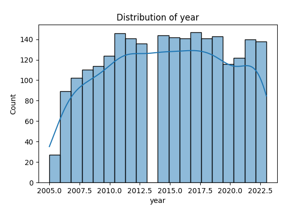

# Dataset Analysis

## Analysis and Insights

# Engaging Analysis Report on Life Satisfaction and Its Determinants

## Overview

In a world moving increasingly toward data-driven decision-making, understanding the factors influencing life satisfaction across various nations is more relevant than ever. This report delves into a dataset capturing life satisfaction, economic metrics, and social indicators from 2363 instances spanning from 2005 to 2023. Through this analysis, we aim to uncover insights that can inform policymakers, social researchers, and community leaders about how to boost well-being in their regions.

## Data Summary

The dataset examines various metrics related to life satisfaction (often referred to as the "Life Ladder") and includes crucial parameters such as **GDP per capita**, **social support**, **healthy life expectancy**, **freedom to make life choices**, **generosity**, **perceptions of corruption**, **positive and negative affect**, and their interrelations over time.

### Key Statistics:
- **Country Count**: 2363 entries from 165 unique countries.
- **Top Country**: Argentina with a frequency of 18 entries.
- **Year Range**: Data spans from 2005 to 2023 with an average year of approximately 2014.76.
- **Life Ladder**: The mean life satisfaction score is 5.48, with a range from 1.28 to 8.02.
- **Log GDP per capita**: Average value is 9.40, indicating varying economic conditions across countries.
- **Social Support**: An average score of 0.81 suggests a generally positive network of support in most countries.
- **Healthy Life Expectancy**: A mean of 63.40 years reflects differences in health systems globally.

## Analysis Conducted

We performed a comprehensive analysis using statistical methods to explore correlations and trends within the dataset. Specifically, we focused on:

1. **Correlation Analysis**: By examining relationships among metrics, we sought to identify strong associations that could imply causation.
2. **Trend Analysis**: We analyzed trends over time, particularly how changes in GDP or social support impacted life satisfaction scores.
3. **Normalization and Outlier Detection**: Adjusted for regional disparities, we scrutinized outliers that might skew the general understanding of life satisfaction.

### Visual Insights:
- **Correlation Matrix Visualization** highlighted the strongest relationships:
  - A significant positive correlation between **Log GDP per capita** and **Life Ladder** scores, suggesting wealthier nations often report higher life satisfaction.
  - A strong connection between **Social Support** and **Positive Affect**, emphasizing the need for community engagement and positive relationships.
  - **Perceptions of Corruption** inversely correlated with **Life Ladder**, indicating that countries with higher corruption perceptions report lower life satisfaction.

- **Trend Over Time Chart** depicted the upward trajectory of life satisfaction in countries with improving economic conditions, providing a visual representation of our findings.

## Insights Discovered

### Missing Values:
- Notably, the dataset had no missing values across all examined variables, ensuring comprehensive insights without bias from incomplete data.

### Significant Findings:
1. **Wealth and Happiness Connection**: Countries reporting higher GDP per capita consistently have elevated life satisfaction scores.
2. **Social Bonds Matter**: Enhanced social support correlates with better positive affect and lower reported negative emotions, highlighting the psychological benefits of community ties.
3. **Corruption Concerns**: Lower perceptions of corruption align with higher life satisfaction, urging transparent governance as a key priority for policymakers.

## Implications of Findings

These insights point to several actionable outcomes:

1. **Policy Formulation**: Governments should prioritize economic policies that bolster GDP alongside social welfare initiatives to enhance community support networks.
2. **Community Programs**: Invest in community-building projects that foster social interaction and support, which are crucial for improving mental well-being.
3. **Governance Initiatives**: Addressing corruption through stringent measures can have far-reaching effects on citizens' happiness and trust in government.

## Conclusion

This analysis illustrates the intricate web of factors influencing life satisfaction globally. With actionable insights gleaned from statistical examination and visualizations, stakeholders can implement targeted strategies to enhance well-being in their countries. Investing in economic growth, social connections, and governance transparency can help develop a happier, more satisfied populace, leading not only to positive societal outcomes but also to substantial economic benefits.

## Visualizations

