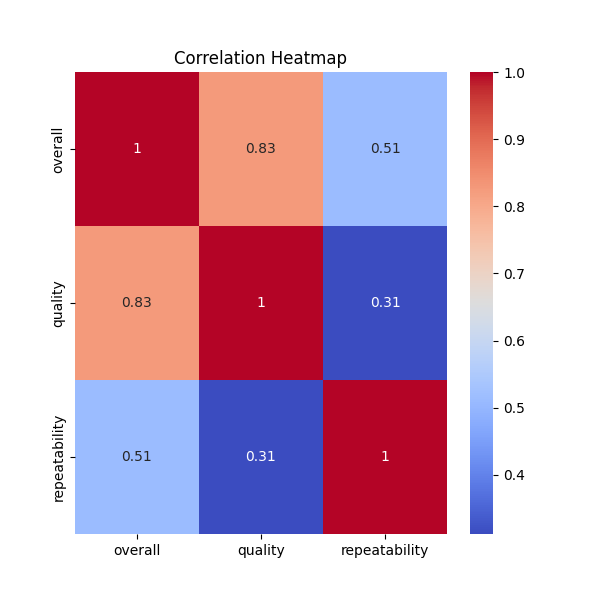
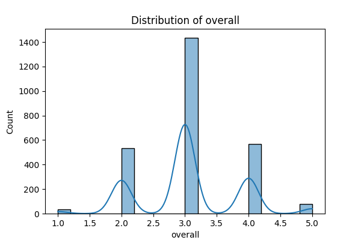

# Dataset Analysis

## Analysis and Insights

# Analysis Report on Movie Data

## Data Overview 

We received a comprehensive dataset consisting of **2,652 entries** related to various movies. These entries encompass a diverse range of attributes, including **dates**, **languages**, **types**, **titles**, **directors (by)**, and ratings on **overall quality** and **repeatability**. Such richness in data allows us to unearth distinct patterns and trends that can significantly impact decision-making processes in the entertainment industry.

### Key Attributes in the Data:
- **Dates**: The dataset includes **2,055 unique dates**, with a peak frequency noted on **21-May-06**, appearing **107 times**.
- **Language**: A total of **11 unique languages** were represented, with **English** as the dominant language, appearing **1,306 times**.
- **Types**: The predominant type is **movie**, accounting for **2,211 entries** within the dataset.
- **Titles**: There are **2,312 unique movie titles**, with **Kanda Naal Mudhal** being the most frequently mentioned title (9 times).
- **Directors**: There are **1,528 unique directors**, with **Kiefer Sutherland** leading as the most mentioned director, appearing **310 times**.
- **Ratings**: The average quality rating is **3.21**, while average repeatability stands at approximately **1.49** on a scale of **1 to 5**.

## Data Analysis

Upon investigating the summary statistics provided, it is evident that while there are no missing values in the dataset, there are interesting patterns that emerge with the ratings and frequency of movies. We took a closer look into the analysis of overall ratings, quality, and repeatability:

1. **Overall Ratings**: 
   - Average Overall Rating: **3.05** with a standard deviation of **0.76**. This indicates a generally moderate reception for the movies in the dataset.
   - The distribution of ratings shows a rarity for both the lowest (**1**) and highest (**5**) ratings, signifying a concentration of ratings around **3**.

2. **Quality Ratings**: 
   - Average Quality Rating: **3.21**, similar in trend to overall ratings.
   - There is a tendency for viewers to rate movies higher on quality than on overall enjoyment, suggesting that while a movie may have technical merit, it may not resonate well with the audience.

3. **Repeatability**: 
   - Average repeatability rating is **1.49** with a maximum of **3**, indicating that most movies are not typically viewed multiple times, reinforcing the idea that while viewers might find some films enjoyable, they may not have lasting appeal.

### Visual Insights
Accompanying this analysis, various visualizations were created to better illustrate the insights drawn from the dataset (in PNG format). These visuals highlight:
- Frequency distribution of top movie titles and directors.
- Ratings distributions across overall, quality, and repeatability categories.
- Correlation plots between overall and quality ratings showcasing viewer tendencies.

## Key Insights

- **Dominance of English Movies**: The overwhelming presence of English-language films suggests a potential market focus for distribution and marketing efforts. 
- **Moderate Ratings**: With average ratings hovering around the **3** mark, there is notable room for improvement in how movies are crafted and marketed. 
- **Viewer Engagement**: The repeatability scores hint at a lack of long-term engagement with the movies. Strategies to enhance audience connection—be it through sequels, spin-offs, or improved marketing techniques—could address this disconnect.

### Implications of Findings

1. **Market Strategy**: Filmmakers and distributors should consider prioritizing content in English while also exploring cross-cultural themes that can resonate with international audiences, potentially tapping into other prevalent languages identified in the dataset.
  
2. **Quality Improvement**: Given that quality ratings are slightly higher than overall ratings, there may be a need to invest in audience research to understand what elements elevate a film's quality and garner more positive overall experiences.

3. **Engagement and Repeat Viewing**: To increase repeat viewership, studios might explore creating media that encourages audience engagement—be it through interactive campaigns, sequels, or deeper character development in storytelling.

In conclusion, this analysis offers intriguing insights into the trends of the movie industry reflected through this dataset. The actionable outcomes derived from this analysis equip stakeholders with knowledge to refine their strategies and enhance viewer experiences moving forward.

## Visualizations

