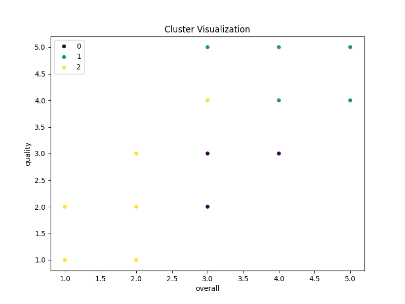

# Dataset Analysis

## Narrative Insights
# Business-Oriented Report on the "Media" Dataset

## 1. Dataset Overview
The dataset comprises a total of 2,652 entries related to various media items, including movies, TV shows, and other types of media content. The data includes several key attributes:

- **Date**: The release or broadcast date of each entry.
- **Language**: The language in which the content is produced.
- **Type**: The category of the media (e.g., movie, TV show).
- **Title**: The name of the media item.
- **By**: The main contributor (e.g., director, producer).
- **Overall Rating**: An aggregate score reflecting the overall quality of the media.
- **Quality Rating**: A score assessing the quality of the media item.
- **Repeatability Rating**: A measure of how often viewers would revisit the content.

### Summary Statistics:
- **Overall Rating**: Mean = 3.05 (on a scale of 1 to 5); Standard Deviation = 0.76, indicating that ratings vary moderately around the mean.
- **Quality Rating**: Mean = 3.21 with a Standard Deviation of 0.80, indicating diverse perceptions of quality amongst viewers.
- **Repeatability Rating**: Mean = 1.49 (out of a maximum of 3), suggesting that most viewers do not revisit the content frequently.

### Unique Entries:
- Languages: 11 unique languages.
- Types: 8 unique media types.
- Titles: 2,312 unique titles, highlighting diverse offerings.

## 2. Key Findings
- **Correlation Analysis**: Key relationships were identified:
  - Overall Rating is positively correlated with Quality (0.83), indicating that content rated higher in quality tends to have higher overall ratings.
  - Repeatability has a moderate correlation with Overall Rating (0.51), suggesting that popular media tends to be revisited by audiences, but not always.
- **Outliers**: Significant outliers were detected across Overall and Quality ratings, indicating some entries may have ratings significantly different from what is typical.
  
- **Cluster Analysis**: The dataset can be segmented into three distinct clusters based on overall and quality ratings, which may signify different audience segments with varied preferences.

## 3. Actionable Recommendations
1. **Content Curation**: 
   - Prioritize producing or acquiring content that falls into the top-rated clusters, as these are likely preferred by audiences. 
   - Consider remixing or revitalizing older successful titles for current audiences to enhance repeatability.
  
2. **Marketing Strategy**:
   - Leverage high quality and overall ratings in promotional materials to attract viewers.
   - Use insights from the language and type of media that yielded the highest ratings to focus marketing efforts effectively.
  
3. **Utilization of Insights**:
   - Regularly assess viewer feedback to understand and adapt content offerings in line with audience preferences.
   - Explore partnerships with creators and authors who have shown a history of delivering content with high ratings to boost potential success rates.

## 4. Visual Insights
### Suggested Visualizations 
1. **Distribution of Ratings**: A histogram showing the distribution of overall ratings would help visualize viewer sentiment toward content.
2. **Heatmap of Correlations**: A heatmap depicting correlations between ratings and other variables would provide actionable insights into relationships.
3. **Clustering Representation**: A scatter plot of clustered data based on ratings could visualize distinguishing audience segments.

*Note: Specific visualizations would need to be created using visualization tools (e.g., matplotlib, seaborn) in Python or similar platforms.*

## 5. Conclusion
The "media" dataset offers rich insights into audience preferences, which can be leveraged to optimize content offerings. High correlations between ratings indicate the importance of quality in viewer satisfaction. By focusing on high-rated content, employing effective marketing strategies, and adapting to the audience's preferences, businesses can enhance viewer engagement and loyalty. Continuous analysis of trends and outlier behaviors will be critical in maintaining competitive advantage in the media landscape.

## Key Visualizations

